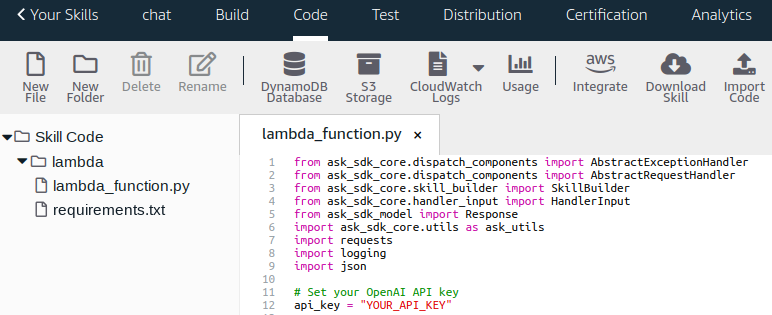
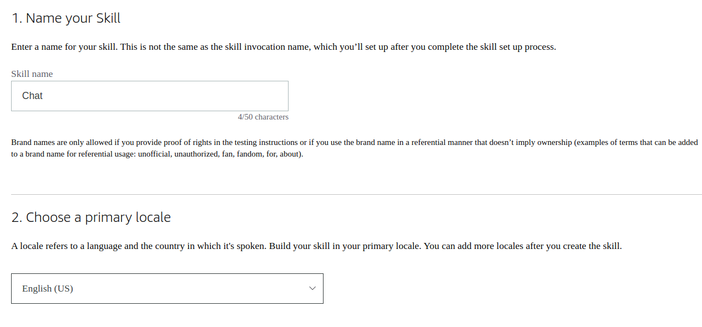
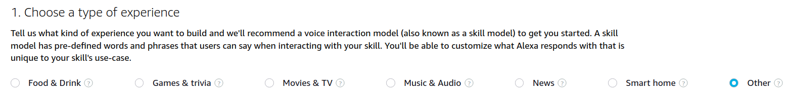
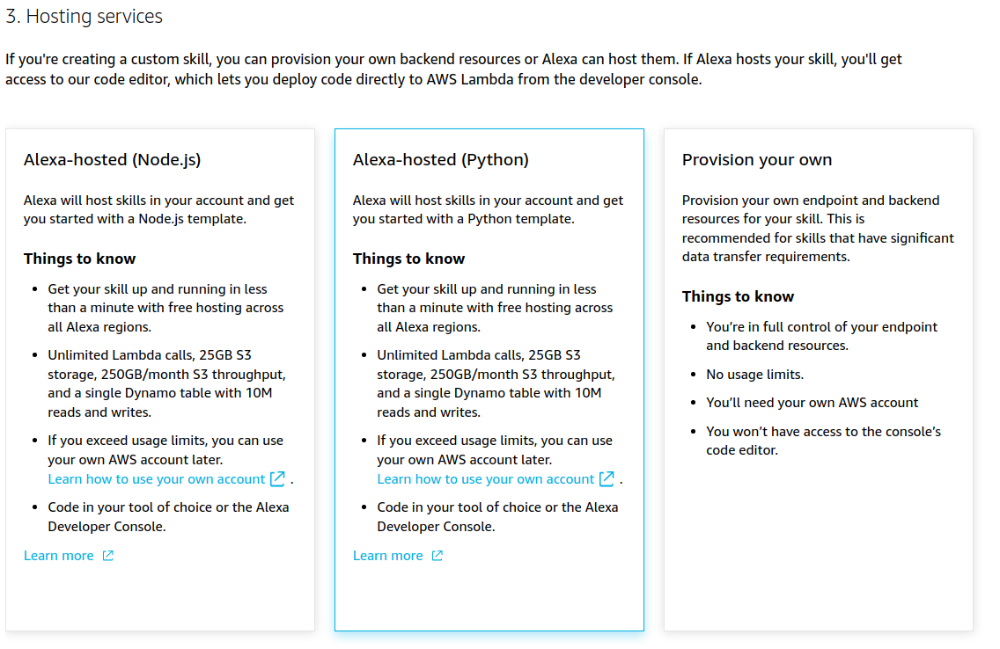
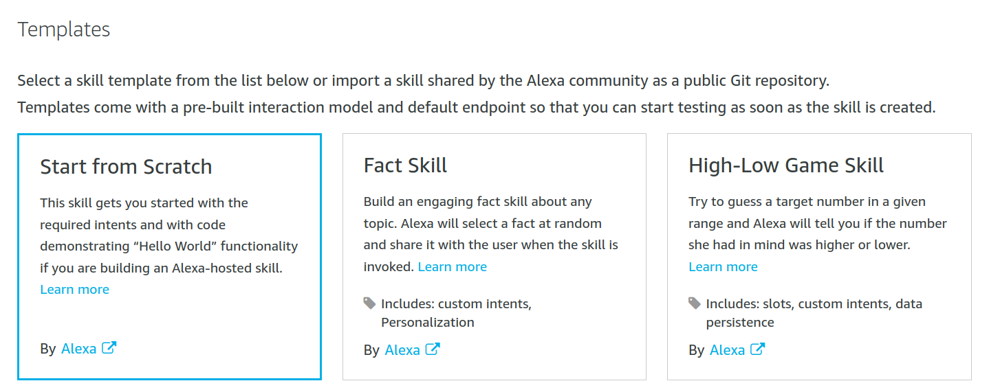
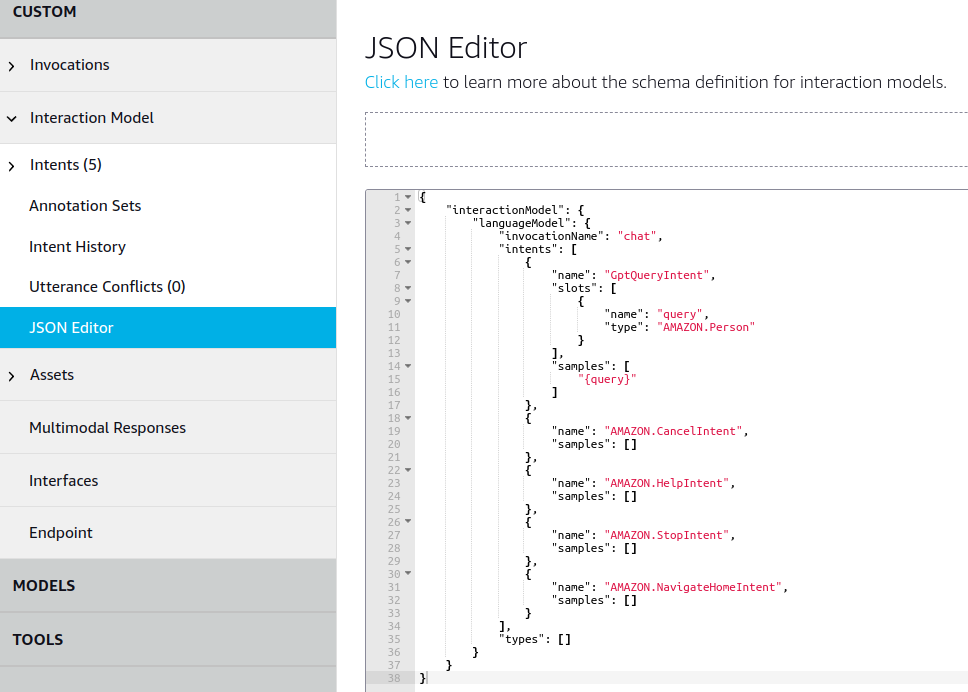
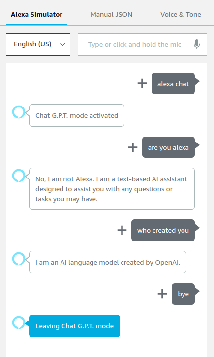

# Jarvis — Skill Alexa propulsée par Gemini

[](https://opensource.org/licenses/MIT)
[](https://www.python.org/)
[](https://ai.google.dev/)

Transforme tes Echo Dot (3, 4, 5) en assistant vocal moderne propulsé par
**Google Gemini**, en français, **gratuitement**.

> 🗣️ *« Alexa, ouvre Jarvis »*
> 🤖 *« Jarvis à ton écoute. Pose ta question. »*
> 🗣️ *« Je veux partir à Lisbonne, combien ça va me coûter ? »*
> 🤖 *« En général, compte entre 400 et 800 euros pour un week-end... »*

---

## ✨ Ce que ça fait

- 🇫🇷 **Conversation vocale en français** avec Gemini 2.5 Flash Lite
- 🧠 **Mémoire de conversation** : Gemini garde le contexte entre tes questions
- 💬 **Texte libre sans préfixe** grâce à `ElicitSlotDirective` — tu parles
  comme tu veux, Alexa capte tout
- 🎯 **~250 carrier phrases** pour les invocations one-shot type
  « Alexa, demande à Jarvis comment faire une omelette »
- 💰 **100 % gratuit** dans la limite des 1 500 requêtes/jour offertes par
  le tier free Gemini

## 🤔 Pourquoi ce projet

Les Echo récents (Dot 3/4/5) ne sont **pas jailbreakables** : leur hardware
est verrouillé par Amazon. Pour avoir un assistant moderne (LLM) sur ton
Echo existant, la voie logicielle est la seule possible : passer par une
skill Alexa custom.

Cette skill est une adaptation francophone et modernisée du template
[k4l1sh/alexa-gpt](https://github.com/k4l1sh/alexa-gpt), avec :

- ✅ Backend **Gemini** au lieu d'OpenAI (gratuit, plus généreux en quotas)
- ✅ Prompt système optimisé pour la **voix** (60 mots max, pas de markdown)
- ✅ Texte libre via **`ElicitSlotDirective`** au lieu de carrier phrases
  obligatoires
- ✅ Documentation **en français**

## 🏗️ Architecture

```
   Toi  →  "Alexa, ouvre Jarvis"
                  │
                  ▼
   Echo (STT Amazon) ──► Alexa Skills Kit
                                │
                                ▼
                AWS Lambda (Alexa-Hosted, Python 3.8)
                                │
                                ▼
                       API Gemini (Flash Lite)
                                │
                                ▼
                          Réponse texte
                                │
                                ▼
   Echo (TTS Amazon) ──► Toi (audio)
```

---

## 📋 Prérequis

| Quoi | Lien | Coût |
|---|---|---|
| Compte Amazon Developer | [developer.amazon.com](https://developer.amazon.com/alexa/console/ask) | Gratuit |
| Compte Google + clé API Gemini | [aistudio.google.com](https://aistudio.google.com/app/apikey) | Gratuit |
| Un Echo lié à ton compte Amazon | Dot 3/4/5, Show, Echo, etc. | — |

---

## 🚀 Installation pas à pas

### Étape 1 — Récupérer une clé API Gemini

1. Va sur [aistudio.google.com](https://aistudio.google.com)
2. Connecte-toi avec ton compte Google
3. Clique **« Get API key »** en haut à gauche
4. **« Create API key »** → choisis « in new project » (recommandé pour
   l'isoler)
5. Copie la clé — elle commence par `AIzaSy...`



> 💡 **Le tier gratuit donne 1 500 requêtes/jour** sur Gemini 2.5 Flash
> Lite. Largement suffisant pour un usage perso.

### Étape 2 — Créer la skill dans Amazon Developer Console

1. Va sur [developer.amazon.com/alexa/console/ask](https://developer.amazon.com/alexa/console/ask)
2. Connecte-toi avec **le même compte Amazon** que tes Echo
3. Clique **« Create Skill »**
4. **Skill name** : « Jarvis » (ou ce que tu veux)
5. **Primary locale** : `French (FR)`



6. **Type of experience** : choisis **« Other »** puis **« Custom »**



7. **Hosting service** : choisis **« Alexa-Hosted (Python) »** —
   c'est gratuit, hébergement inclus



8. Clique **Next**, puis sélectionne le template **« Start from Scratch »**



9. Clique **« Create Skill »**

### Étape 3 — Importer le modèle d'invocation

1. Onglet **Build** en haut
2. Dans le menu de gauche : **Interaction Model → JSON Editor**
3. **Sélectionne tout** le contenu de l'éditeur et **supprime-le**
4. Ouvre le fichier [models/fr-FR.json](models/fr-FR.json) de ce repo
5. **Copie tout** son contenu et **colle** dans le JSON Editor



6. Clique **« Save Model »** puis **« Build Skill »** (en haut)
7. Attends ~1 minute jusqu'à voir un bandeau vert **« Build Successful »**

> ⚠️ **Warning attendu** : Alexa va te dire que `"{query}"` doit avoir une
> carrier phrase. C'est normal et **bénin** dans notre cas — la directive
> `ElicitSlotDirective` côté Lambda contourne cette règle. Tant que c'est
> vert, tout va bien.

### Étape 4 — Déployer le code Lambda

1. Onglet **Code** en haut
2. Ouvre `lambda_function.py` dans l'éditeur de gauche
3. **Sélectionne tout** son contenu et **supprime-le**
4. Ouvre [lambda/lambda_function.py](lambda/lambda_function.py) de ce repo
5. **Copie tout** son contenu et **colle** dans l'éditeur
6. Pareil pour `requirements.txt` : remplace par celui de
   [lambda/requirements.txt](lambda/requirements.txt)
7. ⚠️ **Important** : trouve la ligne `GEMINI_API_KEY = "YOUR_API_KEY"` et
   remplace `YOUR_API_KEY` par **ta vraie clé API Gemini** (celle de
   l'étape 1)
8. Clique **« Save »** (en haut à droite) puis **« Deploy »**
9. Attends « Deployment successful » (~30 s)

### Étape 5 — Tester dans le simulateur

1. Onglet **Test** en haut
2. En haut à gauche, change **« Skill testing is disabled »** →
   **« Development »**


3. Tape ou parle : `ouvre Jarvis`
4. Tu dois entendre/voir : *« Jarvis à ton écoute. Pose ta question. »*
5. Pose une question : `quelle est la capitale du Pérou`
6. Réponse de Gemini en français en 2-4 secondes ✅



### Étape 6 — Utiliser sur ton Echo

La skill est **automatiquement disponible** sur tous tes Echo liés au
compte Amazon (puisque c'est ton propre compte développeur). Aucune
publication sur le store nécessaire.

Sur ton Echo dans le salon :

> 🗣️ *« Alexa, ouvre Jarvis »*

Pose tes questions naturellement, sans préfixe imposé. Pour quitter dis
**« stop »**, pour effacer la mémoire dis **« oublie tout »**.

---

## 🎙️ Exemples d'utilisation

### Conversation continue avec contexte

```
🗣️  ouvre Jarvis
🤖  Jarvis à ton écoute. Pose ta question.
🗣️  je veux partir à Lisbonne combien ça va me coûter
🤖  Pour un week-end depuis Paris, compte 400 à 800 euros incluant...
🗣️  et en avion ça met combien de temps
🤖  Le vol direct dure environ 2h30 depuis Paris...
🗣️  niveau langue ils parlent quoi
🤖  La langue officielle est le portugais. L'anglais est aussi...
```

### Demandes créatives

```
🗣️  écris-moi un poème sur les chats
🗣️  raconte une blague sur les développeurs
🗣️  invente une histoire courte avec un dragon timide
```

### Questions du quotidien

```
🗣️  comment on fait une carbonara authentique
🗣️  c'est quoi la différence entre RAM et SSD
🗣️  pourquoi le ciel est bleu
```

---

## 🔒 Sécurité

### À faire absolument

1. **Restreindre la clé API** dans
   [console.cloud.google.com/apis/credentials](https://console.cloud.google.com/apis/credentials)
   → ta clé → **API restrictions → Restrict key → Generative Language API
   uniquement**.
   ⚠️ Obligatoire avant le 19 juin 2026 (sinon Google désactive
   automatiquement les clés non restreintes).

2. **Ne jamais commit ta clé.** Le code de ce repo a `GEMINI_API_KEY =
   "YOUR_API_KEY"` (placeholder). Ta vraie clé vit uniquement dans le code
   déployé chez Amazon (CodeCommit privé, chiffré).

3. **Ne pas activer Cloud Billing** sur ton projet Google. Sans billing,
   Google ne peut techniquement pas te facturer (HTTP 429 si tu dépasses
   le quota gratuit).

### Le `.gitignore` protège déjà

Ce repo ignore automatiquement `.env`, `.ask/`, `*.key` et tout fichier
sensible. Avant chaque commit, fais `git status` pour vérifier que rien
de perso ne traîne.

---

## 💰 Coûts

| Service | Coût | Limite gratuite |
|---|---|---|
| Alexa-Hosted (Lambda + S3 + DynamoDB) | **0 €** | Illimité pour skills hostées |
| Gemini API (Flash Lite) | **0 €** | 1 500 req/jour, 30 req/min |
| **Total** | **0 €** | Largement suffisant en usage perso |

---

## 🚧 Limites connues

- **Wake word non modifiable** : reste « Alexa » (firmware Echo verrouillé)
- **STT non modifiable** : utilise le moteur de reconnaissance vocale
  d'Amazon, pas Whisper
- **Tier gratuit Gemini** : Google peut utiliser tes prompts pour entraîner
  ses modèles. Pour exclure cet usage, il faut activer la facturation
  (mais ça ouvre un risque de coût)
- **Runtime Python 3.8 d'Alexa-Hosted** : OpenSSL 1.0.2k incompatible avec
  `urllib3 v2`, d'où le pin `urllib3<2` dans `requirements.txt`

---

## 📂 Structure du projet

```
.
├── lambda/
│   ├── lambda_function.py    # Code Lambda (handlers Alexa + appels Gemini)
│   └── requirements.txt      # Dépendances Python
├── models/
│   └── fr-FR.json            # Modèle d'invocation français (intents + dialog)
├── images/                   # Captures d'écran du tutoriel
├── skill.json                # Métadonnées de la skill
├── README.md                 # Ce fichier (tutoriel complet)
└── LICENSE                   # MIT
```

---

## 🛠️ Personnaliser

### Changer la personnalité de Jarvis

Modifie `SYSTEM_INSTRUCTION` dans
[lambda/lambda_function.py](lambda/lambda_function.py) (ligne ~39). Par
exemple, pour un Jarvis sarcastique :

```python
SYSTEM_INSTRUCTION = (
    "Tu es Jarvis, un assistant vocal francophone légèrement sarcastique "
    "branché sur une enceinte Alexa. Réponds toujours en français, en "
    "60 mots maximum, avec une pointe d'humour..."
)
```

### Changer le wake phrase

Modifie `invocationName` dans [models/fr-FR.json](models/fr-FR.json)
(ligne 4). Exemples : `cerveau`, `oracle`, `assistant`. **Reconstruis** le
modèle dans la console Alexa après modification.

### Changer le modèle Gemini

Modifie `GEMINI_MODEL` dans [lambda/lambda_function.py](lambda/lambda_function.py)
(ligne 32). Modèles dispos en gratuit (à vérifier sur Google AI Studio,
les noms évoluent) :
- `gemini-2.5-flash-lite` (par défaut, le plus stable)
- `gemini-2.5-flash` (qualité supérieure, quotas plus serrés)
- `gemini-flash-latest` (alias toujours pointé vers le dernier stable)

---

## 🐛 Dépannage

### « Désolé j'ai eu un souci » à chaque question

Vérifie les logs CloudWatch (onglet Code → bouton CloudWatch Logs). Cas
les plus fréquents :

| Erreur | Cause | Fix |
|---|---|---|
| `HTTP 429` | Quota épuisé | Attends ou réduis l'usage |
| `HTTP 404 model not found` | Modèle Gemini retiré | Change `GEMINI_MODEL` |
| `HTTP 400` | API key invalide | Régénère une nouvelle clé |
| `ImportError urllib3` | OpenSSL incompatible | Vérifier `urllib3<2` dans requirements.txt |

### L'invocation `Jarvis` n'est pas reconnue

- Vérifier que le **Build Model** est bien passé dans l'onglet Build
- Vérifier que la langue de l'Echo dans l'app Alexa est en **français**

### Le simulateur Test affiche `No Content`

Le code Lambda crash avant de répondre. Va dans CloudWatch Logs pour voir
la stack trace Python.

---

## 🙏 Crédits

- Template d'origine : [k4l1sh/alexa-gpt](https://github.com/k4l1sh/alexa-gpt) (MIT)
- LLM : [Google Gemini](https://ai.google.dev/)
- Plateforme : [Amazon Alexa Skills Kit](https://developer.amazon.com/alexa)

## 📜 Licence

[MIT](LICENSE) — fais-en ce que tu veux, mention de l'auteur appréciée.
